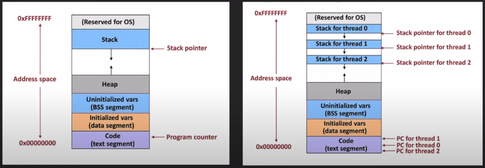

## 📚 사전지식 습득
Spring의 bean, IoC컨테이너를 구현하기 위해 다음의 내용을 먼저 학습하였다.
- DI, IoC, Servlet, Reflection, Spring Bean, Singleton, Factory pattern

**DI, Dependency Injection(의존성 주입)**
```java
//DI 실패 코드
class Car {
    int position;
    private final IntSupplier engine;

    public Car() {
        this.engine = () -> 1;
    }

    public Car(IntSupplier engine) {
        this.engine = engine;
    }

    void move() {
        position += engine.getAsInt();
    }
}


class Client {

    void run() {
        Car car1 = new Car();
        Car car2 = new Car(() -> (int) (Math.random() * 10));
    }
}
```
외부(Clinet)에서 생성자를 통해서 final한 field를 주입(Car의 engine) 한다고 해서 DI인 것은 아니다!

Client의 책임은 자동차를 실행시키는 것인데, 지금은 자동차의 설정(생성)도 담당하고 있다.

여전히 Client와 Car는 강하게 결합되어있다.

따라서 **설정과 실행을 분리**시켜 DIP와 IoC의 원칙을 지키고 DI를 구현하여보자.

```java
class Car {
    //Car에 position이 있든 Client에 있든 DI와는 상관 없다.
    private final IntSupplier engine;

    public Car() {
        this.engine = () -> 1;
    }

    public Car(IntSupplier engine) {
        this.engine = engine;
    }

    int move() {
        return engine.getAsInt();
    }
}


class CarFactory {

    Car getStaticCar() {
        return new Car();
    }
    Car getDynamicCar() {
        return new Car(() -> (int) (Math.random() * 10));
    }
}

class Client {
    private final Car car;
    private int position = 0;

    public Client(Car car) {
        this.car = car;
    }

    void run() {
        position += car.move();
    }
}
```

**Servlet**

자카르타 서블릿(자바 서블릿)은 서블릿 API 사양으로, 서블릿이 지켜야 할 규칙을 정의한 인터페이스와 추상 클래스의 집합이다.

서블릿 컨테이너는 이러한 서블릿 사양을 구현하여 실제 요청을 처리하고 실행시켜주는 프로그램(프레임워크)이다.
- Tomcat, Jetty, Apache Tomcat 등등이 서블릿 컨테이너에 속한다.

이러한 API사양에는 생명주기 메소드인 init(), service(), destroy()가 정의된 최상위 Servlet인터페이스
Servlet인터페이스에서 doGet(), doPost(), service()등을 구현한 HttpServlet 추상클래스
HttpServletRequest, HttpServletResponse, ServletConext, HttpSession 인터페이스 등이 있다.


Servlet 기술 덕분에 사용자는 HTTP요청과 응답에 대한 부분에 대한 파싱에 대한 기술은 Servlet API에 맡기고
다음의 사항만을 코드로 구현하면 된다.(MVC 패턴)

1️⃣ url을 통해 HTTP요청이 들어왔을 때 처리할 수 있도록 HttpServlet을 상속 받은 
@WebServlet(value = "경로") 어노테이션이 붙어 있는 클래스를 작성한다.

2️⃣ HttpServlet의 doGet, doPost(혹은 service)를 오버라이딩 하여 HTTP요청을 처리할 컨트롤러를 호출할 수 있도록 한다.

3️⃣ 컨트롤러는 도메인레이어를 호출하여 비즈니스 로직을 수행하고 이 결과값을
HttpServletRequest의 Attribute에 key-value로 매핑한다.

4️⃣ 컨트롤러는 적절한 view를 호출하여 페이지를 비즈니스 로직의 결과에 따라 동적으로 렌더링하고
추가적인 정보를 HttpServletResponse에 실어 HTTP응답을 보낸다.


```java
//HttpServlet.service();
protected void service(HttpServletRequest req, HttpServletResponse resp) throws ServletException, IOException {
    String method = req.getMethod();
    if (method.equals("GET")) {
        long lastModified = this.getLastModified(req);
        if (lastModified == -1L) {
            this.doGet(req, resp);
        } else {
            long ifModifiedSince = req.getDateHeader("If-Modified-Since");
            if (ifModifiedSince < lastModified) {
                this.maybeSetLastModified(resp, lastModified);
                this.doGet(req, resp);
            } else {
                resp.setStatus(304);
            }
        }
    } else if (method.equals("HEAD")) {
        long lastModified = this.getLastModified(req);
        this.maybeSetLastModified(resp, lastModified);
        this.doHead(req, resp);
    } else if (method.equals("POST")) {
        this.doPost(req, resp);
    } else if (method.equals("PUT")) {
        this.doPut(req, resp);
    } else if (method.equals("DELETE")) {
        this.doDelete(req, resp);
    } else if (method.equals("OPTIONS")) {
        this.doOptions(req, resp);
    } else if (method.equals("TRACE")) {
        this.doTrace(req, resp);
    } else {
        String errMsg = lStrings.getString("http.method_not_implemented");
        Object[] errArgs = new Object[1];
        errArgs[0] = method;
        errMsg = MessageFormat.format(errMsg, errArgs);
        resp.sendError(501, errMsg);
    }

}

```
<details>
<summary><b>❓ 서블릿은 싱글톤으로 관리된다고 들었는데 이러면 특정 URL로 접근되는 HTTP요청은 1개씩만 처리돼? </b></summary>

🤖 아닙니다, 하나의 HTTP 요청만 처리되는 것이 아니라 여러 개의 요청을 동시에 처리할 수 있습니다. 톰캣과 같은 서블릿 컨테이너가 멀티스레딩 방식으로 요청을 처리하기 때문입니다.

서블릿 객체와 스레드 ⚙️

서블릿이 싱글톤(하나의 객체)으로 관리된다는 것은 맞지만, 이는 클라이언트의 모든 요청이 이 하나의 서블릿 객체를 공유한다는 의미입니다. 요청이 들어올 때마다 새로운 서블릿 객체를 생성하는 것이 아니라, 이미 생성된 서블릿 객체를 재활용합니다.

동시에 여러 요청이 들어오면 톰캣은 다음과 같이 동작합니다.

새로운 스레드 생성: 톰캣은 각 요청마다 새로운 **스레드(Thread)**를 생성하거나, 미리 만들어 둔 스레드 풀에서 스레드를 가져옵니다.

스레드가 서블릿 호출: 각 스레드는 공유된 서블릿 객체의 service() 메서드를 호출합니다.

병렬 처리: 이렇게 각 요청은 독립적인 스레드 위에서 실행되므로, 여러 요청이 동시에 처리될 수 있습니다.

따라서 서블릿 객체는 하나이지만, 여러 스레드가 이 객체를 동시에 사용하여 여러 요청을 병렬로 처리할 수 있는 것입니다. 이 때문에 서블릿은 스레드에 안전하지 않은(thread-unsafe) 멤버 변수(인스턴스 변수)를 사용하면 동시성 문제가 발생할 수 있습니다.


그림을 보면, 같은 프로세스에 속한 스레드에서 공유되는 메모리 영역과 그렇지 않은 부분(PC, Stack)이 있다는 것을 확인 할 수 있다.


</details>

<details>
<summary><b>❓ 왜 기존 service()코드에서 get 부분만 로직이 상당히 길까?</b></summary>

🤖 doGet()을 호출하는 service() 메서드 로직이 다른 HTTP 메서드에 비해 긴 이유는 캐싱(Caching) 로직이 추가되었기 때문입니다.

GET 메서드 캐싱 로직의 역할 🧠
HTTP GET 요청은 서버의 데이터를 가져오는 용도로 사용되며, 여러 번 요청해도 서버의 상태를 변경하지 않는 **멱등성(idempotent)**을 가집니다. 이 때문에 브라우저나 프록시 서버는 GET 요청에 대한 응답을 캐시(저장)할 수 있습니다.

제공해주신 코드의 긴 로직은 다음과 같은 캐싱 처리를 담당합니다.

getLastModified(req): 서블릿 컨테이너는 웹 페이지의 마지막 수정 시간을 확인합니다.

        req.getDateHeader("If-Modified-Since"): 클라이언트가 보낸 HTTP 헤더를 확인하여 마지막으로 이 페이지를 가져간 시간을 알아냅니다.

if (ifModifiedSince < lastModified): 만약 클라이언트가 가져간 시간 이후에 페이지가 수정되었다면, 새로운 내용을 doGet()으로 보내줍니다.

        else: 페이지가 수정되지 않았다면, 304 Not Modified 상태 코드를 응답으로 보냅니다. 이 경우 클라이언트는 서버로부터 새로운 데이터를 받지 않고, 로컬에 저장된 캐시를 사용하여 페이지를 렌더링합니다.

이러한 로직은 웹 페이지의 불필요한 데이터 전송을 막아 네트워크 트래픽을 줄이고 웹 사이트의 로딩 속도를 향상시키는 데 큰 역할을 합니다.

다른 HTTP 메서드의 차이 🔀
POST, PUT, DELETE와 같은 메서드는 서버의 데이터를 변경하는 용도이므로 캐시할 수 없습니다. 따라서 별도의 캐싱 로직 없이 doPost(), doPut() 등 해당 메서드를 바로 호출하게 되는 것입니다.

❓ HttpServelet.getLastModified()는 -1을 반환하도록 되어있는데 실제로는 개발자가 오버라이드 해서 수정시간을 반환해야 하는거야?

🤖 네, 맞습니다. getLastModified() 메서드를 오버라이드하여 파일의 수정 시간을 반환하도록 구현할 수 있습니다.

getLastModified()의 기본 동작 🧠
HttpServlet 클래스의 getLastModified() 메서드는 기본적으로 -1L을 반환하도록 구현되어 있습니다.

return -1L; 이 의미하는 바는 **"이 서블릿은 캐시를 사용하지 않는다"**는 뜻입니다. 따라서 doGet() 로직에서 항상 새로운 데이터를 전송하게 됩니다.

캐싱을 활성화하는 방법 ✅
캐싱을 사용하려면 서블릿에서 getLastModified()를 오버라이드하고, 캐시하고자 하는 리소스(파일)의 마지막 수정 시간을 long 타입으로 반환하도록 구현하면 됩니다.

</details>


**Reflection** 

리플렉션을 통해 애노테이션, 생성자, 필드, 메소드, 부모클래스, 인터페이스 등등 클래스 정보들을 얻어낼 수 있다.
- `setAccessible(true)`를 이용해 접근이 제한된 필드나 메소드에 접근하여 호출, 변경할 수 있다.
- `getDeclared...s`는 직접 클래스에서 선언한 ...를 접근제어자에 관계 없이 모두 가져온다.
- `get...s`는 상속한 ...를 포함하여 public인 ...를 모두 가져온다.
- `getDeclaredConstructor(param.class...)`를 통해 생성자를 가져올 수 있다.
- `getMethods`, `getFileds`, `getAnnotations`를 통해 메소드 필드 어토네이션을 가져올 수 있다.

🔍 생성자 `new`로 생성하는 것과 리플렉션의 Constructor.newInstance()를 통해 생성하는 것의 차이

new 연산자
- 컴파일 타임에 클래스의 존재와 생성자를 확인한다. JVM 최적화에 의해 속도가 훨씬 빠르다.
- 컴파일 시점에 생성되므로 타입 안정성이 보장된다.

newInstance()
- 런타임에 클래스의 존재를 확인하고 생성자를 호출한다. 훨씬 속도가 느리다.
- Object로 반환되므로 타입캐스팅이 필요하고 ClassCastException이 발생할 수 있다.

**Spring Bean**

Spring에 의해 빈 컨테이너에 등록된 객체는 싱글톤으로 관리된다.

xml파일에 등록하기, `@Configuration`에 `@Bean`으로 직접 등록하기, `@Component` 스캔으로 등록할 수 있다.

stateless하게 유지해야하고 가급적 읽기만 가능하도록 해야한다.

프로토타입으로 스코프 설정하면 매번 새로운 객체를 반환하며 생성 및 의존성 주입까지만 컨테이너가 관여한다.

따라서, 사용자가 직접 관리하고 소멸 콜백을 호출해야 한다.


<details>
<summary><b>학습 URL</b></summary>

[[Spring] 의존성 주입(Dependency Injection, DI)이란? 및 Spring이 의존성 주입을 지원하는 이유](https://mangkyu.tistory.com/150)

[[10분 테코톡] 오찌, 야호의 DI와 IoC](https://www.youtube.com/watch?v=8lp_nHicYd4)

[[10분 테코톡] 🐶 코기의 Servlet vs Spring](https://www.youtube.com/watch?v=calGCwG_B4Y)

[[10분 테코톡] 헙크의 자바 Reflection](https://www.youtube.com/watch?v=RZB7_6sAtC4)

[[10분 테코톡] 파랑, 아키의 리플렉션](https://www.youtube.com/watch?v=67YdHbPZJn4)

[[10분 테코톡] 토리의 Spring Bean](https://www.youtube.com/watch?v=UcpLNgko8lg)

[[10분 테코톡] 아서의 싱글턴 패턴과 정적 클래스](https://www.youtube.com/watch?v=5oUdqn7WeP0)

[[10분 테코톡] 에드의 팩토리 패턴](https://www.youtube.com/watch?v=bxlNOb5PDS8)

</details>